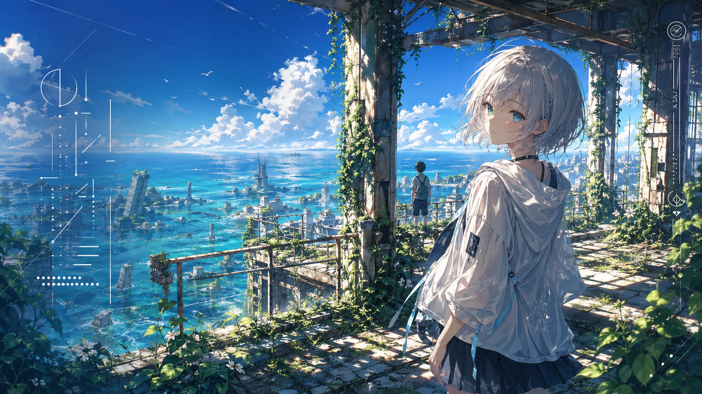

# Style Prompt Forger Skill

`style-prompt-forger` 是一个 Codex/OMX skill，用来从参考图中反推可复用的生图风格提示词，也就是常说的“焚诀”。

核心流程是串行的：

1. 把参考图交给 Gemini，让 Gemini 提取一段通用中文焚诀。
2. 将焚诀里的 `[在此处替换为您想要生成的主体内容]` 替换成新主体。
3. 把替换后的提示词交给 GPT 生图。
4. 如果生成结果跑偏，再回到 Gemini 修订焚诀，然后让 GPT 重新生成。

## 使用场景

- 你有一张海报、插画、设计稿或视觉参考图，想提取它的风格。
- 你想把参考图里的主体换成别的主体，同时保留构图、光影、色彩、质感和版式语言。
- 你想沉淀一段可以反复换主体使用的中文生图 Prompt。
- 你想用 Gemini 做风格分析，用 GPT 只负责最终生图。

## 环境要求

- 已安装 Codex/OMX skill runtime。
- Chrome 或 Chromium 已用 DevTools Protocol 端口 `9222` 启动。
- 该浏览器 Profile 中已经登录 Gemini 和 ChatGPT。
- 可通过 `npx agent-browser --cdp 9222 ...` 控制浏览器。

## 安装

把本仓库复制到 Codex skills 目录：

```bash
cp -R style-prompt-forger-skill ~/.codex/skills/style-prompt-forger
```

然后在 Codex 中调用：

```text
@style-prompt-forger
```

推荐用法：直接上传参考图，并写清楚要替换成什么主体。

## 案例

这个案例使用我们实际跑过的参考原图和成品图。

参考原图：


成品图：



参考原图来源：Bilibili 视频 `基于image2的ATRI系列海报~`，UP 主 `汤沐黎Eather`，链接 https://www.bilibili.com/video/BV1hoouBsE5B/，发布时间 `2026-04-24 01:29:36 +0800`。图中版权标识为 `©ATRI ANIME PROJECT`。该图仅作为风格分析案例的参考输入；生成图使用原创主体，不保留原图角色、片名、logo 或可读版权文字。

当时的用户输入可以写成：

```text
@style-prompt-forger
参考图：一张 16:9 动漫海报，蓝色海面、废墟建筑、强烈夏日光影、右侧人物构图。
目标主体：把人物替换成原创动漫少女，银白短发、青色眼睛、白色夏季外套、深色裙装。
要求：保持参考图的海报感、构图、光影、色彩和末世重生氛围，不要保留原图角色、IP、logo 或可读文字。
```

Gemini 会先输出类似这样的焚诀：

```text
[在此处替换为您想要生成的主体内容]，画面呈现高分辨率日系电影海报风格，采用高角度全景构图与极深景深，前景为被绿色植物侵蚀的废弃建筑结构，中景为广阔海面与被淹没的城市废墟，强烈午后阳光从右侧射入，形成清晰光斑、长阴影和高对比边缘光。色彩以清透深蓝、海水青蓝、植物绿色为主，辅以混凝土灰、锈蚀金属棕和暖白高光，材质包含粗糙混凝土、生锈栏杆、爬藤、闪光水面和流动云层。画面左侧保留海报式留白与抽象伪文字排版，右侧可有竖排装饰性伪文字，整体氛围怀旧、宁静、夏日、孤独与希望并存，精细商业动画海报质感，干净线稿，细腻光影，超高细节。
```

替换占位符后交给 GPT：

```text
一名原创动漫少女，银白色短发，清澈青色眼睛，穿简洁白色夏季外套与深色裙装，站在画面右侧回头望向观众；远处有一名原创少年背向海面远眺。画面呈现高分辨率日系电影海报风格……
```

最终输出应是一张新主体海报，而不是原图复刻。合格结果需要满足：

- 主体已经替换，不复制参考图角色。
- 构图、光影、色彩、材质和氛围能看出参考图风格。
- 不出现原图 IP、片名、logo、真实品牌或可读版权文字。
- 生成图可作为新风格海报使用。

## 注意事项

- 直接上传参考图最快，网盘、视频网站或网页截图会增加大量取图和浏览器操作成本。
- Gemini 只负责提取和修订焚诀，GPT 只负责根据焚诀生图。
- 不要把 Gemini 和 GPT 的回答并行合并；这个 skill 的核心是“Gemini 提取 -> GPT 生成 -> Gemini 修订 -> GPT 再生成”。
- 如果结果太像原图，应让 Gemini 删除具体角色、服装、IP、文字、地点和唯一性构图标识，只保留可迁移的视觉规律。

## 来源参考

本 skill 的工作流思路参考了 Bilibili 视频：

- 标题：`GPT焚决？给你反推焚决的焚决！基于 Gemini + GPT 的提取风格+生图的生图流程`
- 作者：`咲凌_Arisa`
- 链接：https://www.bilibili.com/video/BV1eKojBkE5e/
- 发布时间：`2026-04-24 20:25:30 +0800`

本仓库是基于该视频思路整理的独立 Codex/OMX skill 实现。
